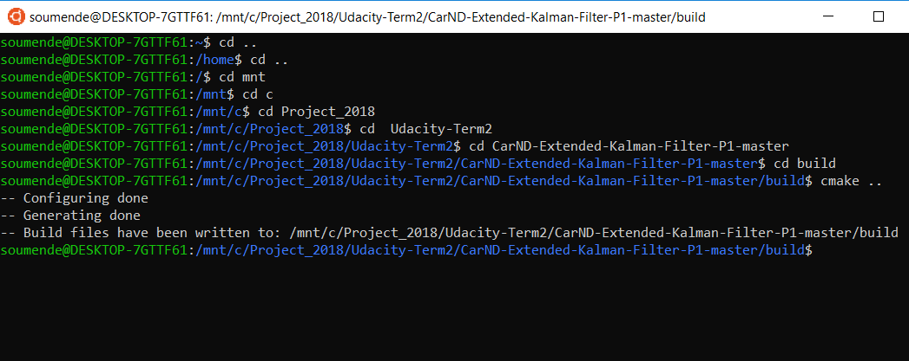

# CarND-Extended-Kalman-Filter-P1
Udacity Self-Driving Car Nanodegree - Extended Kalman Filter Implementation

# Overview
This project consists of implementing an Extended Kalman Filter with C++. A simulator provided by Udacity ([it could be downloaded here](https://github.com/udacity/self-driving-car-sim/releases)) generates noisy RADAR and LIDAR measurements of the position and velocity of an object, and the Extended Kalman Filter[EKF] must carry out a fusion of those measurements to predict the position of the object. The communication between the simulator and the EKF is done using [WebSocket](https://en.wikipedia.org/wiki/WebSocket) using the [uWebSockets](https://github.com/uNetworking/uWebSockets) implementation on the EKF side.
The starting code is provided by Udacity and was forked in the working directory. [This code is found here](https://github.com/udacity/CarND-Extended-Kalman-Filter-Project).

# Prerequisites

The project has the following dependencies (from Udacity's seed project):

- cmake >= 3.5
- make >= 4.1
- gcc/g++ >= 5.4
- Udacity's simulator.

For instructions on how to install these components on different operating systems, please, visit [Udacity's seed project](https://github.com/udacity/CarND-Extended-Kalman-Filter-Project). This implementation was done in the windows environment

# Environment Setup

I used the Windows 10 environment to develop and build the code. Bash on Windows 10 was used to set up the environment. Windows 10 users is an Ubuntu Bash environment that works great and is easy to setup and use. Here is a nice step by step guide for [setting up the Ubuntu Bash](https://www.howtogeek.com/249966/how-to-install-and-use-the-linux-bash-shell-on-windows-10/) All of the projects in Term 2 and some in Term 3 involve using an open source package called uWebSocketIO. This package facilitates the necessary connection between the simulator and code.Once the Ubuntu is installed the <code>install-ubuntu.sh </code> was run to install the uWebSocketIO and other project dependencies.
  
## Ubuntu BASH on Windows
* Steps
- Ensure all dependencies are present as per [project resources](https://goo.gl/e2kwJT)
- Follow these the instructions in the [uWebSocketIO starter guide](https://goo.gl/D8hMoa) which includes instructions for setting up   Ubuntu BASH.
- open Ubuntu Bash and clone the project repository- 
- on the command line execute <code>./install-ubuntu.sh</code>
- build and run according to the instructions in the project repository README

# Compiling and executing the project

These are the suggested steps:

- Clone the repo and cd to it on a Terminal.
- Create the build directory: `mkdir build`
- `cd build`
- `cmake ..`
- `make`: This will create two executables
  - `ExtendedKF` : EKF implementation.
  - `Test` : Simple unit tests using [Catch](https://github.com/philsquared/Catch/blob/master/docs/tutorial.md).


These unit tests were an experiment with [Catch](https://github.com/philsquared/Catch/blob/master/docs/tutorial.md). It looks like a good and simple unit testing framework for C++.

## Running the Filter

From the build directory, execute `./ExtendedKF`. The output should be:

```
Listening to port 4567
Connected!!!
```

As you can see, the simulator connect to it right away.

The following is an image of the simulator:


The simulator provides two datasetsdepending on the order the first measurement is sent to the EKF

- On dataset 1, the LIDAR measurement is sent first.
- On dataset 2, the RADAR measurement is sent first.

Here is the simulator final state after running the EKL with dataset 1:


Here is the simulator final state after running the EKL with dataset 2:


# [Rubric](https://review.udacity.com/#!/rubrics/748/view) points

## Compiling

### Your code should compile

The code compiles without errors. I did change the [CMackeLists.txt](./CMakeLists.txt) to add the creation of the `./Tests`. I don't think this will create incompatibilities with other platforms, but I only test it on Mac OS.

## Accuracy

### px, py, vx, vy output coordinates must have an RMSE <= [.11, .11, 0.52, 0.52] when using the file: "obj_pose-laser-radar-synthetic-input.txt which is the same data file the simulator uses for Dataset 1"

The EKF accuracy was:

- Dataset 1 : RMSE <= [0.0973, 0.0855, 0.4513, 0.4399]
- Dataset 2 : RMSE <= [0.0726, 0.0965, 0.4216, 0.4932]

## Following the Correct Algorithm

### Your Sensor Fusion algorithm follows the general processing flow as taught in the preceding lessons.

The Kalman filter implementation can be found [src/kalman_filter.cpp](./src/kalman_filter.cpp) and it is used to predict at [src/FusionEKF.cpp](./src/FusionEKF)

### Your Kalman Filter algorithm handles the first measurements appropriately.

The first measurement is handled at [src/FusionEKF.cpp](./src/FusionEKF.cpp#L61) from line 61 to line 107.

### Your Kalman Filter algorithm first predicts then updates.

The predict operation could be found at [src/FusionEKF.cpp](./src/FusionEKF.cpp#L147) line 147 and the update operation from line 159 to 169 of the same file.FusionEKF.cpp

### Your Kalman Filter can handle radar and lidar measurements.

Different type of measurements are handled in two places in [src/FusionEKF.cpp](./src/FusionEKF.cpp):

- For the first measurement from line 61 to line 107.
- For the update part from line 159 to 169.

## Code Efficiency

### Your algorithm should avoid unnecessary calculations.

An example of this calculation optimization is when the Q matrix is calculated [src/FusionEKF.cpp](./src/FusionEKF.cpp#L141) line 135 to line 144.
